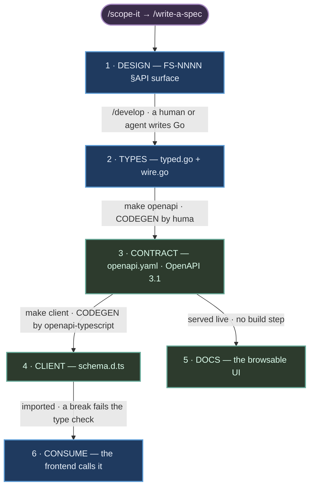

# How the API contract works

Orientation for anyone new to this repo — backend or frontend. It answers the standard
questions (*what is "the contract"? what's generated? what do I edit?*) and nothing more; the
per-endpoint detail lives in the contract document itself.

---

## The one-sentence version

You write the **design** in a spec and the **types** in code; a tool derives the **contract
document** from those types, another tool derives the **client** from that document, and CI
fails if any of them drift apart.

---

## The five things, and what each is called

| Thing | Where | Produced by | Authored or derived |
|---|---|---|---|
| **The design** | `docs/specs/FS-NNNN` → `§API surface` | `/scope-it` → `/write-a-spec` | **authored** — a human ratifies it |
| **The implementation** | `game-server/api-gateway/internal/gateway/<group>/typed.go` (+ `wire.go` in the groups that have one) | `/develop` | **authored** — a human or an agent |
| **The API contract** | `game-server/api-gateway/openapi.yaml` | `make openapi` — codegen by huma | **derived** — never hand-edited |
| **The generated client** | `game-client/src/api/generated/schema.d.ts` | `make client` — codegen by openapi-typescript | **derived** — never hand-edited |
| **The API docs** | `http://localhost:7114/api/docs` | served live by huma | **derived** — no build step, no file |

The words people usually conflate:

- **"The API contract"** is `game-server/api-gateway/openapi.yaml` — the machine-readable agreement, in **OpenAPI 3.1**.
  It is what tools consume and what CI diffs.
- **"The API docs"** is the browsable UI at `http://localhost:7114/api/docs`. It is *rendered from the contract
  document*, not maintained separately — so the docs cannot be out of date with the contract.
  If they disagree with reality, the contract is wrong, not the docs.
- **"The schema"** usually means one type inside the contract (`Member`, `SigninBody`). They
  live under `components.schemas`.
- **"The spec"** is ambiguous — in this repo it usually means the **feature spec** (`FS-NNNN`,
  the design), not the OpenAPI document. Say "the contract" or "the OpenAPI document" when you
  mean the generated file.

---

## Running it locally — and why the docs URL dies after a reboot

**The docs UI is not a service.** It is served by the gateway process itself: huma mounts it at
`/api/docs` on the same port the API listens on. There is no docs container, no build step, and
no file on disk. If the gateway is not running, the URL is simply dead — which is exactly what
happens after a machine restart, because the containers it depends on stopped with it.

From `game-server/`:

```bash
docker compose up -d
```

That brings up consul, rabbitmq, redis, and one Postgres per service. The gateway will not boot
without them. Then, from `game-server/api-gateway/`:

```bash
make run
```

Use `make dev` instead if you want hot reload (it runs `air`). Then open:

```
http://localhost:7114/api/docs
```

**What you're looking at.** Huma renders the page with **Stoplight Elements**, loaded from a CDN
(`unpkg.com`). Two consequences worth knowing before you file a bug:

- **You need internet for the docs page**, even though the API itself is entirely local. Offline,
  you get a blank frame — the contract is fine, the renderer just never downloaded.
- **The page is a renderer, not a source.** It reads `/api/openapi`, which huma derives from your
  Go types on the fly. So the docs cannot disagree with the running server. If they disagree with
  what you *expected*, your types are the thing that's wrong.

`/api/docs` and `/api/openapi` are **deliberately public** — no auth. That was a decision, not an
oversight; ADR-0002 §6 records why and names the trigger that would reverse it.

**When it doesn't come up:**

| Symptom | Cause |
|---|---|
| connection refused on 7114 | gateway isn't running — `make run` |
| gateway exits on boot | containers are down — `docker compose up -d` first |
| page loads blank / unstyled | no internet; Stoplight Elements couldn't fetch from the CDN |
| docs load but an endpoint is missing | it was never registered with `huma.Register` — check the group's `typed.go` |

Want the contract without a browser? `curl localhost:7114/api/openapi.yaml` — huma serves both
`.yaml` and `.json` off that path. The committed copy at `game-server/api-gateway/openapi.yaml`
should be byte-identical; if it isn't, `make openapi-diff` will say so.

---

## The journey of one endpoint



**Read the colours:** purple is a **skill you invoke**, blue is **authored by a person or an
agent**, green is **produced by a tool**. The edge label is *what performs that step* — a skill,
or a command that runs codegen.

Nothing green is ever hand-edited, by a person or an agent. CI regenerates it and fails on any
difference.

---

## Why this stays consistent — the part that matters

Plenty of teams write an API doc alongside the code. That is not what this is, and the
difference is worth understanding before you add your first endpoint.

**A hand-maintained doc is a second derivation of the same intent.** You write a description,
someone builds a handler from it, and someone writes a doc from it. Two interpretations of one
piece of prose. They can disagree with each other — and, more dangerously, they can *agree with
each other* while both having drifted from what shipped last month.

The failure mode is not sloppiness. It is **re-derivation**. Every new feature sends someone
back to the prose to re-interpret the whole shape, and prose does not pin a field name. A `title`
comes back as a `header`, the doc is rewritten to match, and the two artifacts are perfectly
self-consistent. Nothing looks wrong. That is exactly why nobody catches it.

Here, the contract is **generated from types, not written**. That single choice changes the
problem from *keeping two artifacts in sync* — which needs memory and discipline, forever — to
*projecting one artifact* — which is mechanical. The document has no independent existence to
drift with.

The consequence that does the real work:

> **The parts you did not touch are never re-derived.**

When a feature adds a field, every existing field's name is already in code, untouched.
Regeneration *reads* it; it does not interpret it. Regenerating untouched code produces
byte-identical output — which is precisely what the regenerate-and-diff gate asserts on every
run. There is no moment at which an existing field is re-read from prose and could come back
under a different name.

```
hand-maintained     prose ──→ code
                    prose ──→ doc        two lossy derivations,
                                         BOTH REDONE every feature

this flow           prose ──→ code       ONE lossy derivation, ONCE per field
                     code ──→ contract   mechanical, repeatable, exact
                 contract ──→ client     mechanical, repeatable, exact
```

### Why the one lossy step is survivable

Prose to code is still human interpretation. Three things keep it contained:

- **It is a delta, not a restatement.** A feature spec's `§API surface` describes what that
  feature *changes*. Feature specs are write-once, so an old one is never edited and re-derived
  when a new one lands.
- **It is typed.** Once a field exists in code, the compiler enforces every use of it. A
  plausible-sounding alternative name is not plausible to a compiler; it is undefined.
- **It is checked against history, not memory.** The breaking-change gate compares the new
  projection against the one on the default branch. Nobody has to remember the old field name
  for a rename to be caught.

### What this does *not* protect against

Being straight about the edge, because the guarantee is narrower than "no ambiguity":

- For a **brand-new** field, nothing mechanical validates that the name means what the author
  intended. What is guaranteed is that it can never silently change afterwards.
- A spec that **adds** a field duplicating an existing one — `header` alongside `title` — is an
  *addition*, and no diff-based gate objects to additions. That stays a review question.

So the accurate claim is not that this flow prevents ambiguity. It is that **ambiguity gets
exactly one chance to enter, at a small surface, and is frozen the moment it does** — instead of
a fresh chance on every feature, across the whole surface, forever.

---

## What is generated by a *tool*, not by an agent

This distinction matters when an AI agent works in the repo:

- `game-server/api-gateway/openapi.yaml` is produced by **huma** reading your handler's Go types. It is
  deterministic. An agent that "writes some OpenAPI" has done the wrong thing.
- `game-client/src/api/generated/schema.d.ts` is produced by **openapi-typescript** reading the contract document. Same rule.

If either file appears in a diff without the corresponding handler change, something went
wrong. The regenerate-and-diff gate exists to catch exactly that.

---

## What you actually edit

**Adding or changing an endpoint:**

1. Write the row in the feature spec's `§API surface` (design first — this is the part a human
   ratifies).
2. Add the request/response structs **next to the operation that uses them**. Two layouts are
   both current, and you follow whichever the group already uses: `auth` and `item` keep types
   in a separate `wire.go`; `notification`, `payment`, and `stats` declare them at the top of
   `typed.go`. Do not introduce a `wire.go` into a group that hasn't got one.
3. Register the operation with `huma.Register(api, huma.Operation{...})` in that group's
   `typed.go`. The struct tags on your input/output types are what huma reads — they *are* the
   contract, so a missing `doc:` tag is a lint failure, not a cosmetic one.
4. Run `make openapi && make client`.
5. Commit the handler **and** both generated files together.

That's it. No route registration, no schema authoring, no client hand-editing.

---

## The gates, and what each one refuses

| Gate | Refuses |
|---|---|
| `make openapi-diff` | a committed contract that doesn't match the code |
| `make lint-contract` (Spectral) | operations with no description or no documented errors |
| `make openapi-breaking` (oasdiff) | a breaking change, unless allowlisted deliberately |
| client staleness check | a committed client that doesn't match the contract |
| `make contract-auth` | an operation whose auth requirement doesn't match its declared security |
| `make seam-gate` | a handler reaching past the error-mapping seam (FS-0001) |
| `make gates-selftest` | **itself, if the contract gates above have stopped enforcing** |
| `make seam-gate-selftest` | **itself, if the seam gate has stopped enforcing** |

`make gates` runs all seven in order and is the one to run before pushing.

The last one is the unusual one. A gate that cannot tell "passed" from "did not run" emits a
green check either way, which is worse than no gate because it is trusted. So the gates are
pointed at deliberately-broken fixtures and required to reject them.

---

## Errors are part of the contract

Failures are **RFC 9457 `application/problem+json`**, and every one carries a stable
`code`:

```json
{ "type": "about:blank", "title": "Unauthorized", "status": 401,
  "detail": "Wrong email or password.", "code": "UNAUTHENTICATED", "errors": [] }
```

- **Switch on `code`.** It is contract: removing or repurposing one is a breaking change.
- **Display `detail`.** It is prose, explicitly *not* contract. Never branch on it.
- **`errors[]` is always present**, empty when there is no field-level detail, so you never
  null-check before iterating.
- **Adding a code is not breaking**, so clients must tolerate one they have never seen —
  fall back to `detail` rather than failing.

Every operation lists the statuses it can produce, so the failure modes are visible in the docs
next to the success case.

---

## Frequently asked

**Where do I look to see what an endpoint returns?** `http://localhost:7114/api/docs` if you want to read it,
`game-client/src/api/generated/schema.d.ts` if you want to import it. Both derive from `game-server/api-gateway/openapi.yaml`.

**Can I just use `fetch`?** No — against a serialized path it's a review failure, and lint
enforces it. The point is that a contract change breaks the build rather than a user's session.

**Something isn't in the contract. Is that a bug?** Not necessarily. Endpoints outside the
governed surface (third-party webhooks, WebSocket traffic) are excluded on purpose and named in
the owning feature spec's *Out of Scope*. Check there before assuming.

**The contract says something the code doesn't do.** That cannot happen through the normal
flow — the contract is derived from the code. If you see it, someone hand-edited a generated
file, and `make openapi-diff` should have caught it.

**Why is every field optional in the generated types?** Because the wire format says so. That
is the contract being honest rather than the generator being unhelpful; handle absence at the
call site.
