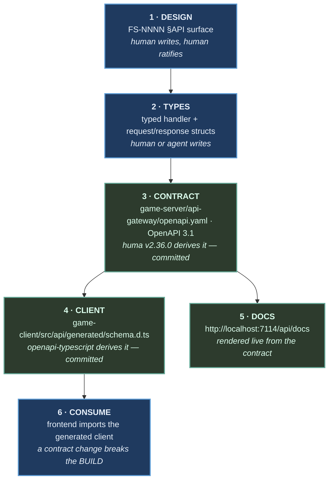

# How the API contract works

Orientation for anyone new to this repo — backend or frontend. It answers the standard
questions (*what is "the contract"? what's generated? what do I edit?*) and nothing more; the
per-endpoint detail lives in the contract document itself.

---

## The one-sentence version

You write the **design** in a spec and the **types** in code; a tool derives the **contract
document** from those types, another tool derives the **client** from that document, and CI
fails if any of them drift apart.

---

## The five things, and what each is called

| Thing | Where | Who writes it |
|---|---|---|
| **The design** | `docs/specs/FS-NNNN` → `§API surface` | **A human.** Prose and a table |
| **The implementation** | `game-server/api-gateway/internal/gateway/<group>/typed.go`, `wire.go` | **A human or an agent.** Typed handlers |
| **The API contract** | `game-server/api-gateway/openapi.yaml` | **A tool.** Never hand-edited |
| **The generated client** | `game-client/src/api/generated/schema.d.ts` | **A tool.** Never hand-edited |
| **The API docs** | `http://localhost:7114/api/docs` (live) | **Nobody.** Rendered from the contract |

The words people usually conflate:

- **"The API contract"** is `game-server/api-gateway/openapi.yaml` — the machine-readable agreement, in **OpenAPI 3.1**.
  It is what tools consume and what CI diffs.
- **"The API docs"** is the browsable UI at `http://localhost:7114/api/docs`. It is *rendered from the contract
  document*, not maintained separately — so the docs cannot be out of date with the contract.
  If they disagree with reality, the contract is wrong, not the docs.
- **"The schema"** usually means one type inside the contract (`Member`, `SigninBody`). They
  live under `components.schemas`.
- **"The spec"** is ambiguous — in this repo it usually means the **feature spec** (`FS-NNNN`,
  the design), not the OpenAPI document. Say "the contract" or "the OpenAPI document" when you
  mean the generated file.

---

## The journey of one endpoint



**Blue is authored. Green is derived.** Nothing green is ever edited by hand — not by a person,
not by an agent. CI regenerates it and fails on any difference.

---

## What is generated by a *tool*, not by an agent

This distinction matters when an AI agent works in the repo:

- `game-server/api-gateway/openapi.yaml` is produced by **huma v2.36.0** reading your handler's Go types. It is
  deterministic. An agent that "writes some OpenAPI" has done the wrong thing.
- `game-client/src/api/generated/schema.d.ts` is produced by **openapi-typescript** reading the contract document. Same rule.

If either file appears in a diff without the corresponding handler change, something went
wrong. The regenerate-and-diff gate exists to catch exactly that.

---

## What you actually edit

**Adding or changing an endpoint:**

1. Write the row in the feature spec's `§API surface` (design first — this is the part a human
   ratifies).
2. Add the request/response structs to `game-server/api-gateway/internal/gateway/<group>/wire.go`.
3. Add the operation in `game-server/api-gateway/internal/gateway/<group>/typed.go`.
4. Run `make openapi && make client`.
5. Commit the handler **and** both generated files together.

That's it. No route registration, no schema authoring, no client hand-editing.

---

## The gates, and what each one refuses

| Gate | Refuses |
|---|---|
| `make openapi-diff` | a committed contract that doesn't match the code |
| `make lint-contract` (Spectral) | operations with no description or no documented errors |
| `make openapi-breaking` (oasdiff) | a breaking change, unless allowlisted deliberately |
| client staleness check | a committed client that doesn't match the contract |
| `make gates-selftest` | **itself, if the gates above have stopped enforcing** |

The last one is the unusual one. A gate that cannot tell "passed" from "did not run" emits a
green check either way, which is worse than no gate because it is trusted. So the gates are
pointed at deliberately-broken fixtures and required to reject them.

---

## Errors are part of the contract

Failures are **RFC 9457 `application/problem+json`**, and every one carries a stable
`code`:

```json
{ "type": "about:blank", "title": "Unauthorized", "status": 401,
  "detail": "Wrong email or password.", "code": "UNAUTHENTICATED", "errors": [] }
```

- **Switch on `code`.** It is contract: removing or repurposing one is a breaking change.
- **Display `detail`.** It is prose, explicitly *not* contract. Never branch on it.
- **`errors[]` is always present**, empty when there is no field-level detail, so you never
  null-check before iterating.
- **Adding a code is not breaking**, so clients must tolerate one they have never seen —
  fall back to `detail` rather than failing.

Every operation lists the statuses it can produce, so the failure modes are visible in the docs
next to the success case.

---

## Frequently asked

**Where do I look to see what an endpoint returns?** `http://localhost:7114/api/docs` if you want to read it,
`game-client/src/api/generated/schema.d.ts` if you want to import it. Both derive from `game-server/api-gateway/openapi.yaml`.

**Can I just use `fetch`?** No — against a serialized path it's a review failure, and lint
enforces it. The point is that a contract change breaks the build rather than a user's session.

**Something isn't in the contract. Is that a bug?** Not necessarily. Endpoints outside the
governed surface (third-party webhooks, WebSocket traffic) are excluded on purpose and named in
the owning feature spec's *Out of Scope*. Check there before assuming.

**The contract says something the code doesn't do.** That cannot happen through the normal
flow — the contract is derived from the code. If you see it, someone hand-edited a generated
file, and `make openapi-diff` should have caught it.

**Why is every field optional in the generated types?** Because the wire format says so. That
is the contract being honest rather than the generator being unhelpful; handle absence at the
call site.
